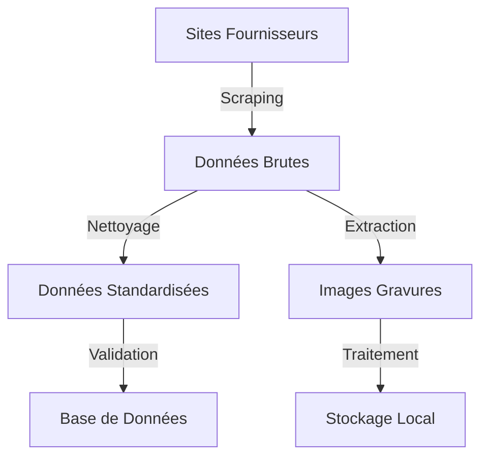

# E1 - Gestion des Données pour le Système de Gravures Optiques

## 📋 Contexte du Projet

### Présentation
Ce module (E1) constitue la première étape d'un projet de certification Développeur IA. Il établit les fondations d'un système de gestion des gravures de verres optiques, qui sera enrichi par des fonctionnalités d'IA dans les phases ultérieures.

### Acteurs
- **Utilisateurs finaux** : Opticiens cherchant à optimiser leur processus de recherche de gravures
- **Développeur** : Développeur IA en charge de la conception et réalisation
- **Client test** : Opticien partenaire pour les revues de sprint

## 🎯 Objectifs

### Objectifs Fonctionnels
- Collecter automatiquement les données des verres depuis les sites fournisseurs
- Nettoyer et standardiser les données pour une utilisation future
- Stocker les données de manière structurée et optimisée
- Préparer l'infrastructure pour les futures fonctionnalités IA

### Objectifs Techniques
- Temps de recherche cible : < 30 secondes
- Base de données normalisée et optimisée
- API REST avec FastAPI
- Solution containerisée (Docker)
- Compatible multi-plateforme

### Contraintes Techniques
- Respect du RGPD pour la gestion des tokens API
- Connexion internet standard requise
- Pas de contraintes matérielles spécifiques

## 🔧 Environnement Technique

### Architecture
- Base de données SQLite
- API FastAPI
- Conteneurisation Docker
- Scripts Python pour le scraping et le traitement des données

### Compatibilité
- Multi-plateforme (Windows, Linux, MacOS)
- Navigateurs web modernes
- Connexion internet standard

## 📅 Organisation et Planification

### Méthodologie
- **Approche** : Scrum
- **Durée** : 3 mois
- **Sprint** : 2 semaines
- **Review** : Fin de chaque sprint avec l'opticien partenaire

### User Stories Principales
1. **Collecte des Données**
   ```
   En tant que développeur,
   Je veux scraper les sites des fournisseurs
   Afin de collecter les données des verres
   ```

2. **Nettoyage des Données**
   ```
   En tant que développeur,
   Je veux nettoyer et standardiser les données
   Afin d'assurer leur qualité et leur cohérence
   ```

3. **Stockage Optimisé**
   ```
   En tant que développeur,
   Je veux stocker les données dans une base normalisée
   Afin de faciliter les futures requêtes
   ```

4. **Gestion des Images**
   ```
   En tant que développeur,
   Je veux gérer le téléchargement et le stockage des images
   Afin de conserver les gravures de manière organisée
   ```

5. **Structure Base de Données**
   ```
   En tant que développeur,
   Je veux mettre en place une structure de base optimisée
   Afin de supporter les futures fonctionnalités
   ```

### Planning des Sprints

#### Sprint 1-2 : Infrastructure
- Mise en place de l'environnement
- Création de la structure de base de données
- Configuration du scraping

#### Sprint 3-4 : Collecte et Traitement
- Développement des scrapers
- Implémentation du nettoyage des données
- Tests de collecte

#### Sprint 5-6 : Optimisation et Documentation
- Optimisation des performances
- Documentation technique
- Tests d'intégration

## 📊 Mesures de Succès
- Base de données structurée et normalisée
- Données nettoyées et standardisées
- Tests unitaires et d'intégration passants
- Documentation technique complète
- Infrastructure prête pour les phases suivantes

## 🔄 Workflow des Données


## 📝 Notes
- Ce module E1 constitue la fondation pour les futures fonctionnalités IA
- L'accent est mis sur la qualité et la structure des données
- La documentation est considérée comme un délivrable critique 