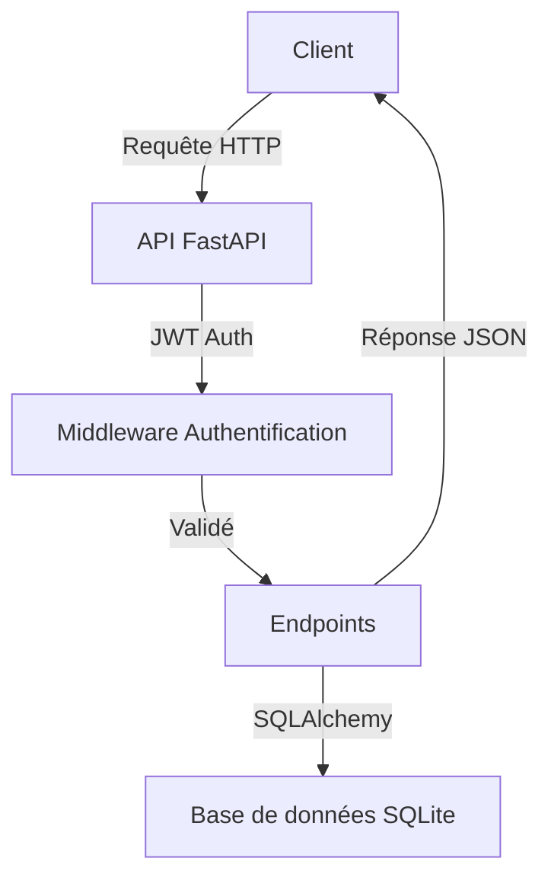
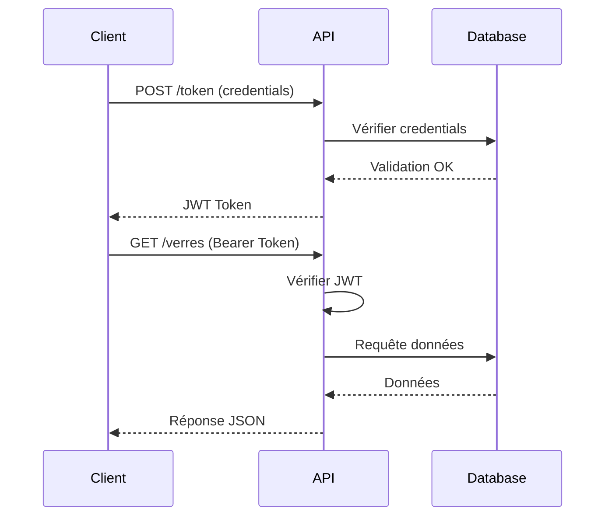
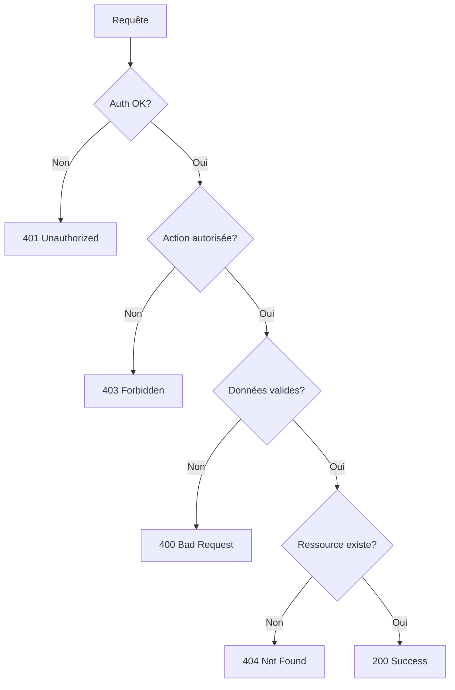

# API France Optique - Documentation Technique

## Table des matières
- [Vue d'ensemble](#vue-densemble)
- [Architecture](#architecture)
- [Installation](#installation)
- [Authentification](#authentification)
- [Points de terminaison (Endpoints)](#points-de-terminaison)
- [Modèles de données](#modèles-de-données)
- [Gestion des erreurs](#gestion-des-erreurs)
- [Tests](#tests)

## Vue d'ensemble

L'API France Optique est une API REST sécurisée permettant de gérer et d'accéder aux données des verres optiques. Elle utilise FastAPI pour offrir une interface moderne et performante.



## Architecture

Structure du projet :
```
api/
├── app/
│   ├── auth/
│   │   ├── __init__.py
│   │   └── jwt_auth.py
│   ├── models/
│   │   ├── __init__.py
│   │   └── database.py
│   ├── schemas/
│   │   ├── __init__.py
│   │   └── schemas.py
│   ├── __init__.py
│   ├── config.py
│   └── main.py
├── Base_de_donnees/
│   └── france_optique.db
├── .env
├── generate_secret.py
├── README.md
├── requirements.txt
└── run.py
```

## Installation

1. **Prérequis**
   - Python 3.8+
   - pip

2. **Configuration de l'environnement**
```bash
# Créer un environnement virtuel
python -m venv venv

# Activer l'environnement
source venv/bin/activate  # Linux/Mac
venv\Scripts\activate     # Windows

# Installer les dépendances
pip install -r requirements.txt
```

3. **Configuration sécurisée**

⚠️ **IMPORTANT : Configuration de la sécurité**

a. Créer le fichier `.env` :
```bash
# Copier le template
cp .env.example .env

# Générer une nouvelle clé secrète
python generate_secret.py
```

b. Modifier le fichier `.env` avec vos propres valeurs :
- Changez `ADMIN_EMAIL` et `ADMIN_PASSWORD`
- En production, désactivez `DEBUG`
- Limitez les origines CORS
- Utilisez un mot de passe fort

c. Sécurité :
- Ne JAMAIS commiter le fichier `.env`
- Ne JAMAIS partager les secrets
- Changer régulièrement les mots de passe
- En production, utilisez des variables d'environnement

4. **Lancement**
```bash
python run.py
```

## Authentification

L'API utilise l'authentification JWT (JSON Web Token) avec le schéma Bearer.

> ⚠️ **Sécurité** : Les identifiants d'administration doivent être gardés secrets et changés régulièrement. Les exemples ci-dessous utilisent des identifiants fictifs à des fins de démonstration uniquement.



### Obtention du token

```bash
curl -X POST "http://localhost:8000/token" \
     -H "Content-Type: application/x-www-form-urlencoded" \
     -d "username=votre_email" \
     -d "password=votre_mot_de_passe"
```

Réponse :
```json
{
    "access_token": "eyJhbGciOiJIUzI1...",
    "token_type": "bearer"
}
```

### Bonnes pratiques de sécurité

1. **Gestion des identifiants**
   - Ne jamais partager ou exposer les identifiants d'administration
   - Utiliser des mots de passe forts
   - Changer régulièrement les mots de passe
   - Stocker les identifiants de manière sécurisée (variables d'environnement)

2. **Gestion des tokens**
   - Ne jamais stocker les tokens JWT en clair
   - Respecter leur durée de validité
   - Renouveler les tokens avant expiration
   - Ne pas transmettre les tokens via des canaux non sécurisés

## Points de terminaison

### Authentification

| Méthode | Endpoint | Description | Auth requise |
|---------|----------|-------------|--------------|
| POST | `/token` | Obtenir un token JWT | Non |

### Verres optiques

| Méthode | Endpoint | Description | Auth requise |
|---------|----------|-------------|--------------|
| GET | `/verres` | Liste des verres | Oui |
| GET | `/verres/{id}` | Détails d'un verre | Oui |
| GET | `/verres/search` | Recherche de verres | Oui |
| POST | `/verres` | Créer un nouveau verre | Oui |
| DELETE | `/verres/{id}` | Supprimer un verre | Oui |

```mermaid
flowchart LR
    Client --> Token[/token]
    Client --> ListeVerres[/verres]
    Client --> DetailVerre[/verres/id]
    Client --> Recherche[/verres/search]
    Client --> Creation[/verres POST]
    Client --> Suppression[/verres/id DELETE]
    
    Token --> Auth[JWT Token]
    ListeVerres & DetailVerre & Recherche & Creation & Suppression --> Protection[Auth Required]
```

## Modèles de données

### Verre
```json
{
    "id": 1,
    "nom": "string",
    "variante": "string",
    "hauteur_min": 0,
    "hauteur_max": 100,
    "indice": 1.5,
    "gravure": "string",
    "url_source": "string",
    "fournisseur": {
        "id": 1,
        "nom": "string"
    },
    "materiau": {
        "id": 1,
        "nom": "string"
    },
    "gamme": {
        "id": 1,
        "nom": "string"
    },
    "serie": {
        "id": 1,
        "nom": "string"
    },
    "traitements": [
        {
            "id": 1,
            "nom": "string",
            "type": "string"
        }
    ]
}
```

### Création d'un verre
```json
{
    "nom": "string",
    "variante": "string",
    "hauteur_min": 0,
    "hauteur_max": 100,
    "indice": 1.5,
    "gravure": "string",
    "url_source": "string",
    "fournisseur_id": 1,
    "materiau_id": 1,
    "gamme_id": 1,
    "serie_id": 1
}
```

## Gestion des erreurs

| Code | Description | Exemple |
|------|-------------|---------|
| 200 | Succès | Verre créé ou supprimé avec succès |
| 400 | Requête invalide | Données de création invalides |
| 401 | Non authentifié | Token manquant ou invalide |
| 403 | Non autorisé | Droits insuffisants |
| 404 | Ressource non trouvée | Verre à supprimer non trouvé |
| 422 | Erreur de validation | Champs requis manquants |
| 500 | Erreur serveur | Erreur lors de la suppression |



## Tests

### Test avec curl

1. **Obtenir un token**
```bash
curl -X POST "http://localhost:8000/token" \
     -H "Content-Type: application/x-www-form-urlencoded" \
     -d "username=votre_email" \
     -d "password=votre_mot_de_passe"
```

2. **Liste des verres**
```bash
curl -X GET "http://localhost:8000/verres" \
     -H "Authorization: Bearer votre_token"
```

3. **Recherche de verres**
```bash
curl -X GET "http://localhost:8000/verres/search?query=photochromique" \
     -H "Authorization: Bearer votre_token"
```

4. **Créer un nouveau verre**
```bash
curl -X POST "http://localhost:8000/verres" \
     -H "Authorization: Bearer votre_token" \
     -H "Content-Type: application/json" \
     -d '{
       "nom": "Nouveau Verre",
       "variante": "Standard",
       "indice": 1.5,
       "hauteur_min": 0,
       "hauteur_max": 100,
       "gravure": "NV-001"
     }'
```

5. **Supprimer un verre**
```bash
curl -X DELETE "http://localhost:8000/verres/1" \
     -H "Authorization: Bearer votre_token"
```

### Test avec Python

```python
import requests

# Configuration
BASE_URL = "http://localhost:8000"
credentials = {
    "username": "votre_email",
    "password": "votre_mot_de_passe"
}

# Obtenir le token
response = requests.post(f"{BASE_URL}/token", data=credentials)
token = response.json()["access_token"]

# Headers avec le token
headers = {
    "Authorization": f"Bearer {token}",
    "Content-Type": "application/json"
}

# Créer un nouveau verre
nouveau_verre = {
    "nom": "Nouveau Verre",
    "variante": "Standard",
    "indice": 1.5,
    "hauteur_min": 0,
    "hauteur_max": 100,
    "gravure": "NV-001"
}
creation = requests.post(
    f"{BASE_URL}/verres",
    headers=headers,
    json=nouveau_verre
)
print("Verre créé:", creation.json())

# Supprimer un verre
suppression = requests.delete(
    f"{BASE_URL}/verres/1",
    headers=headers
)
print("Résultat suppression:", suppression.json())
```

## Documentation OpenAPI

La documentation interactive OpenAPI (Swagger) est disponible à :
- http://localhost:8000/docs
- http://localhost:8000/redoc (format ReDoc)

> ⚠️ **Note de sécurité** : En production, assurez-vous de :
> - Désactiver la documentation Swagger si elle n'est pas nécessaire
> - Limiter l'accès à la documentation aux adresses IP autorisées
> - Ne jamais exposer les identifiants d'administration dans la documentation
> - Utiliser HTTPS pour toutes les communications

Cette documentation est générée automatiquement et inclut :
- Tous les endpoints avec leurs paramètres
- Les schémas de requête et réponse
- Les exemples de requêtes
- L'interface de test interactive 