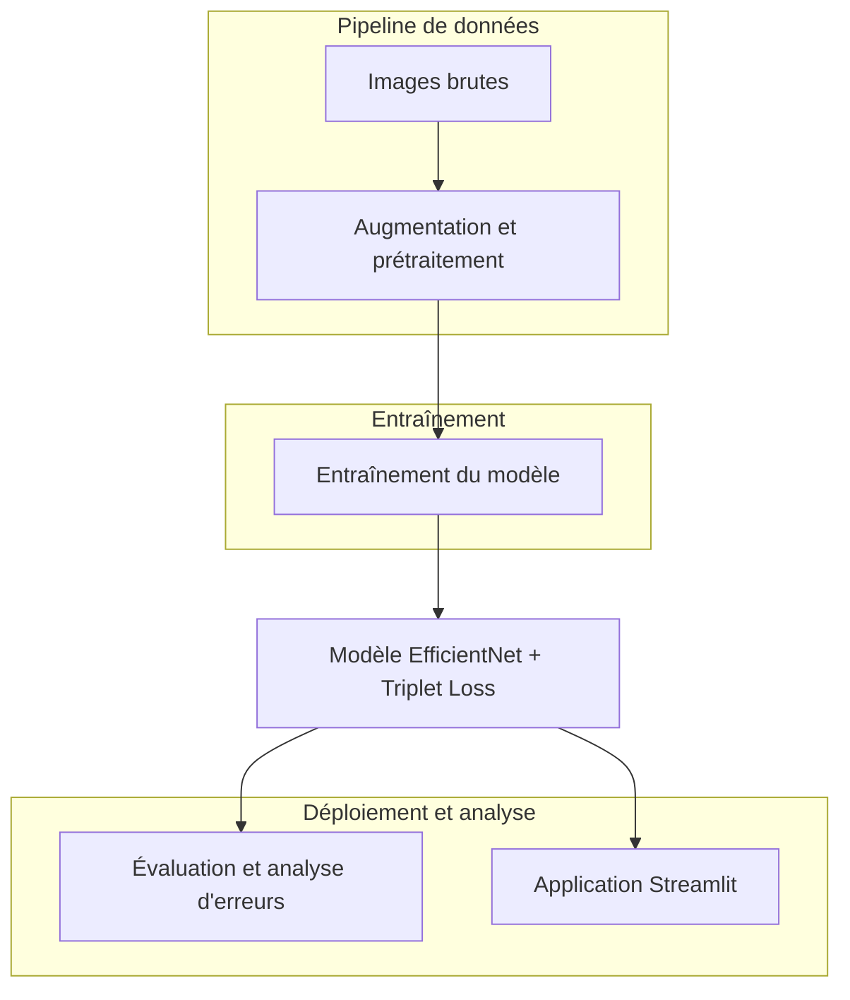

# Reconnaissance de Gravures avec Deep Learning

Ce projet implémente un système de reconnaissance de gravures basé sur des techniques modernes de deep learning. Le système utilise principalement un modèle EfficientNet optimisé avec Triplet Loss pour identifier et classifier différents types de gravures, même avec peu d'exemples par classe.

## Fonctionnalités principales

- **Reconnaissance précise** de multiples classes de gravures
- **Interface utilisateur intuitive** avec Streamlit
- **Pipeline d'augmentation de données** pour améliorer la robustesse du modèle
- **Équilibrage automatique des classes minoritaires**
- **Analyse détaillée des erreurs** pour améliorer continuellement les performances
- **Embeddings de haute qualité** pour les comparaisons d'images

## Architecture du système



## Structure du projet

```
E3_MettreDispositionIA/
│
├── app/                             # Code source principal
│   ├── efficientnet_model.py        # Modèle EfficientNet avec Triplet Loss
│   ├── data_augmentation.py         # Fonctions d'augmentation de données
│   ├── train_efficientnet.py        # Script d'entraînement du modèle
│   ├── evaluate_model.py            # Évaluation des performances
│   ├── analyze_errors.py            # Analyse détaillée des erreurs
│   ├── oversample_small_classes.py  # Rééquilibrage des classes minoritaires
│   └── model.py                     # Modèle Siamese (alternative)
│
├── data/                            # Données pour l'entraînement et validation
│   ├── raw_gravures/                # Images brutes par classe 
│   └── augmented_gravures/          # Images augmentées par classe
│
├── model/                           # Modèles entraînés
│   └── best_efficientnet_triplet.pt # Meilleur modèle EfficientNet
│
├── archive/                         # Scripts et modèles archivés
│
├── streamlit_app/                   # Ressources pour l'application
│   └── drawings/                    # Dessins sauvegardés
│
├── embeddings/                      # Visualisations d'embeddings
│
├── streamlit_app.py                 # Application Streamlit principale
├── run_gravure_pipeline.py          # Pipeline complet d'entraînement
├── config.py                        # Configuration globale
├── start_streamlit_app.sh           # Script de lancement de l'application
├── requirements.txt                 # Dépendances du projet
└── README.md                        # Documentation principale
```

## Installation

1. Cloner le dépôt:
```bash
git clone <URL_DU_REPO>
cd E3_MettreDispositionIA
```

2. Installer les dépendances:
```bash
pip install -r requirements.txt
```

## Pipeline complet automatisé

Le projet inclut un script `run_gravure_pipeline.py` qui automatise l'ensemble du processus de traitement des gravures, de l'augmentation des données jusqu'au lancement de l'application.

### Étapes du pipeline

1. **Augmentation des données** - Génère des variations des images d'origine pour améliorer la robustesse du modèle
2. **Équilibrage des classes sous-représentées** - Identifie et équilibre les classes avec trop peu d'exemples
3. **Entraînement du modèle** - Entraîne le modèle EfficientNet avec les paramètres optimaux
4. **Évaluation des performances** - Évalue la précision du modèle et génère des rapports
5. **Analyse des erreurs** - Identifie les confusions entre classes et crée des visualisations explicatives
6. **Lancement de l'application** - Démarre l'interface Streamlit (optionnel)

### Utilisation du pipeline

Pour exécuter le pipeline complet avec les paramètres par défaut:

```bash
python run_gravure_pipeline.py
```

#### Options principales

```bash
# Exécution complète avec lancement de l'application à la fin
python run_gravure_pipeline.py --launch_streamlit

# Ajuster le nombre d'époques et la taille du batch
python run_gravure_pipeline.py --epochs 100 --batch_size 32

# Personnaliser les seuils pour l'équilibrage des classes
python run_gravure_pipeline.py --min_threshold 15 --target_count 30

# Sauter certaines étapes (si déjà réalisées)
python run_gravure_pipeline.py --skip_augmentation --skip_oversampling
```

#### Options avancées

```bash
# Configurer les paramètres d'entraînement avancés
python run_gravure_pipeline.py --progressive_unfreeze --initial_freeze 0.7 --onecycle --mining_type hard

# Spécifier des dossiers personnalisés
python run_gravure_pipeline.py --input_dir "mon/dossier/gravures" --output_dir "mon/dossier/augmenté"
```

### Liste complète des paramètres

| Paramètre | Valeur par défaut | Description |
|-----------|-------------------|-------------|
| `--input_dir` | `data/raw_gravures` | Dossier contenant les images brutes |
| `--output_dir` | `data/augmented_gravures` | Dossier pour les images augmentées |
| `--epochs` | 50 | Nombre d'époques d'entraînement |
| `--batch_size` | 16 | Taille du lot d'entraînement |
| `--balance_classes` | True | Équilibrer les classes pendant l'entraînement |
| `--progressive_unfreeze` | True | Dégel progressif des couches du modèle |
| `--initial_freeze` | 0.8 | Proportion initiale des couches gelées |
| `--onecycle` | True | Utiliser le scheduler OneCycleLR |
| `--mining_type` | "semi-hard" | Type de mining pour triplet loss |
| `--min_threshold` | 10 | Nombre minimum d'images par classe |
| `--target_count` | 20 | Nombre cible d'images après équilibrage |
| `--skip_augmentation` | False | Ignorer l'étape d'augmentation |
| `--skip_oversampling` | False | Ignorer l'étape d'équilibrage |
| `--skip_evaluation` | False | Ignorer l'étape d'évaluation |
| `--launch_streamlit` | False | Lancer l'application après l'entraînement |

## Flux de travail manuel

Si vous préférez exécuter les étapes séparément, voici la procédure à suivre:

### 1. Préparation des données

Organisez vos images de gravures dans des sous-dossiers par classe dans `data/raw_gravures/`:

```
data/raw_gravures/
├── classe1/
│   ├── image1.jpg
│   ├── image2.jpg
│   └── ...
├── classe2/
│   ├── image1.jpg
│   └── ...
└── ...
```

### 2. Augmentation des données

```bash
python app/data_augmentation.py --raw_dir data/raw_gravures --output_dir data/augmented_gravures
```

### 3. Équilibrage des classes minoritaires

Si certaines classes ont trop peu d'exemples:

```bash
python app/oversample_small_classes.py --raw_dir data/raw_gravures --augmented_dir data/augmented_gravures --min_threshold 10 --target_count 20
```

### 4. Entraînement du modèle

```bash
python app/train_efficientnet.py --data_dir data/augmented_gravures --epochs 50 --batch_size 16 --embedding_dim 256 --progressive_unfreeze --onecycle
```

### 5. Évaluation du modèle

```bash
python app/evaluate_model.py --model_path model/best_efficientnet_triplet.pt --model_type efficientnet --data_dir data/augmented_gravures --output_dir model/evaluation_results
```

### 6. Analyse des erreurs

```bash
python app/analyze_errors.py --incorrect_dir model/incorrect_predictions --output_dir model/error_analysis
```

### 7. Lancement de l'application

```bash
bash start_streamlit_app.sh
```

Ou sous Windows:

```bash
streamlit run streamlit_app.py
```

## Description des composants principaux

### Modèle EfficientNet avec Triplet Loss

Le modèle principal utilise une architecture EfficientNet-B0 préentraînée sur ImageNet, avec une couche d'embedding personnalisée et un apprentissage par Triplet Loss avec mining intelligent pour obtenir des représentations vectorielles (embeddings) de haute qualité.

Avantages:
- Architecture optimisée avec excellent équilibre performance/ressources
- Utilisation de transfert d'apprentissage 
- Mining intelligent des triplets difficiles
- Meilleures performances avec peu d'exemples
- Facilité d'ajout de nouvelles classes sans réentraînement complet

### Pipeline d'augmentation de données

Les techniques d'augmentation utilisées incluent:
- Rotations et flips
- Ajustements de contraste et luminosité
- Élasticité et déformations
- Coupes aléatoires et zoom
- Ajouts de bruit et flou
- Simulations d'imperfections de numérisation

### Équilibrage des classes

Le système identifie automatiquement les classes sous-représentées et génère des exemples supplémentaires avec des augmentations plus fortes pour équilibrer le dataset.

### Application Streamlit

L'interface utilisateur permet:
- De dessiner une gravure directement dans l'application
- De télécharger une image pour analyse
- De visualiser les classes les plus probables
- D'explorer les images similaires dans la base de données
- De comprendre les caractéristiques principales détectées

## Paramètres d'entraînement optimaux

Les paramètres recommandés pour l'entraînement sont:

| Paramètre | Valeur | Description |
|-----------|--------|-------------|
| epochs | 50 | Nombre d'époques d'entraînement |
| batch_size | 16 | Taille du lot d'entraînement |
| embedding_dim | 256 | Dimension du vecteur d'embedding |
| progressive_unfreeze | True | Dégel progressif des couches |
| initial_freeze | 0.8 | Proportion initiale de couches gelées |
| onecycle | True | Utilisation du scheduler OneCycleLR |
| mining_type | semi-hard | Type de mining pour les triplets |
| balance_classes | True | Équilibrer les classes pendant l'entraînement |

## Performances et métriques

Le modèle actuel atteint:
- **Précision**: ~97.5% sur le jeu de test
- **Qualité d'embeddings**: Excellente séparation des classes en utilisant t-SNE
- **Robustesse**: Bonne résistance aux variations de style et d'orientation

## Résolution de problèmes courants

- **Erreur CUDA**: Si vous rencontrez des problèmes avec CUDA, assurez-vous d'avoir installé PyTorch avec le support CUDA correspondant à votre GPU.
- **Mémoire insuffisante**: Réduisez la taille du batch ou utilisez un modèle plus léger.
- **Classes confondues**: Utilisez l'analyse d'erreurs pour identifier et corriger les problèmes de classification.
- **Nouveaux symboles**: Ajoutez simplement quelques exemples dans le dossier correspondant et relancez l'entraînement.

## Développements futurs

- Implémentation d'un système d'apprentissage continu
- Ajout d'un mode d'annotation collaborative
- Optimisation pour les appareils mobiles
- Support pour les séquences de gravures et motifs complexes

## Licence

Ce projet est distribué sous licence [Insérer la licence appropriée].

## Remerciements

- [Liste des contributeurs ou références]
- [Bibliothèques et ressources utilisées] 