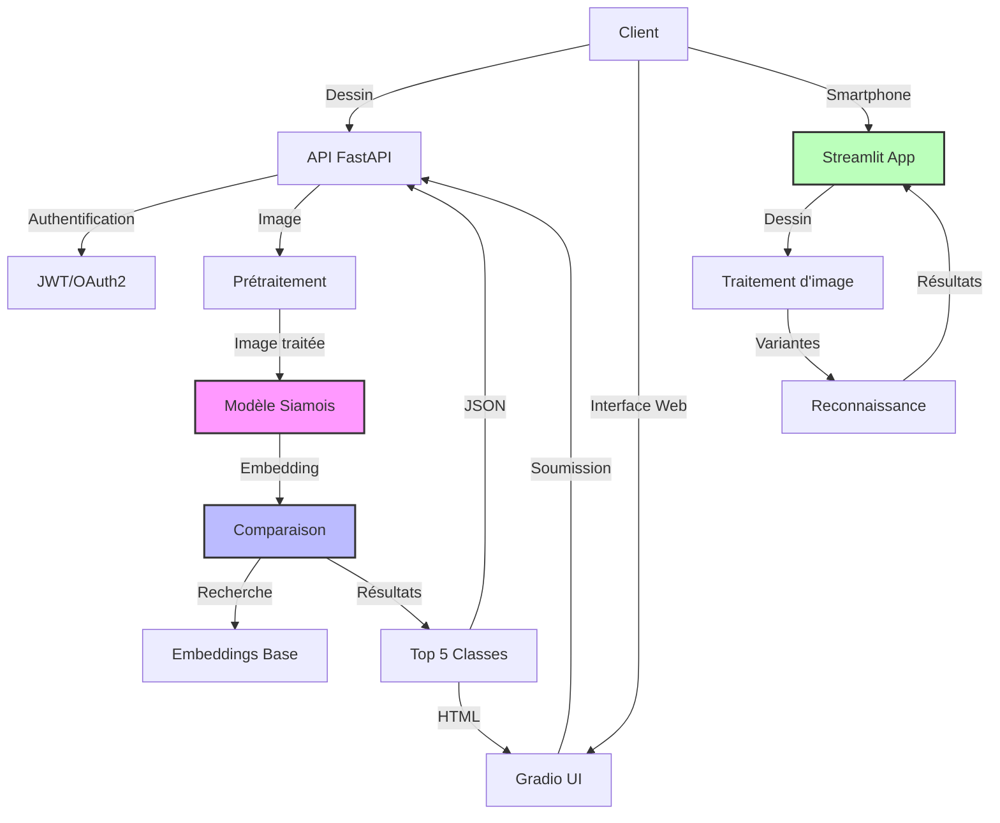
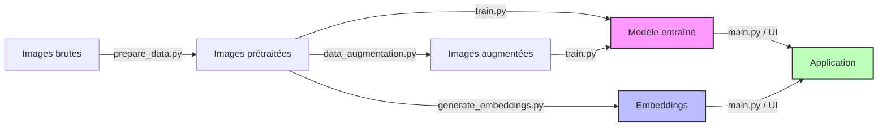
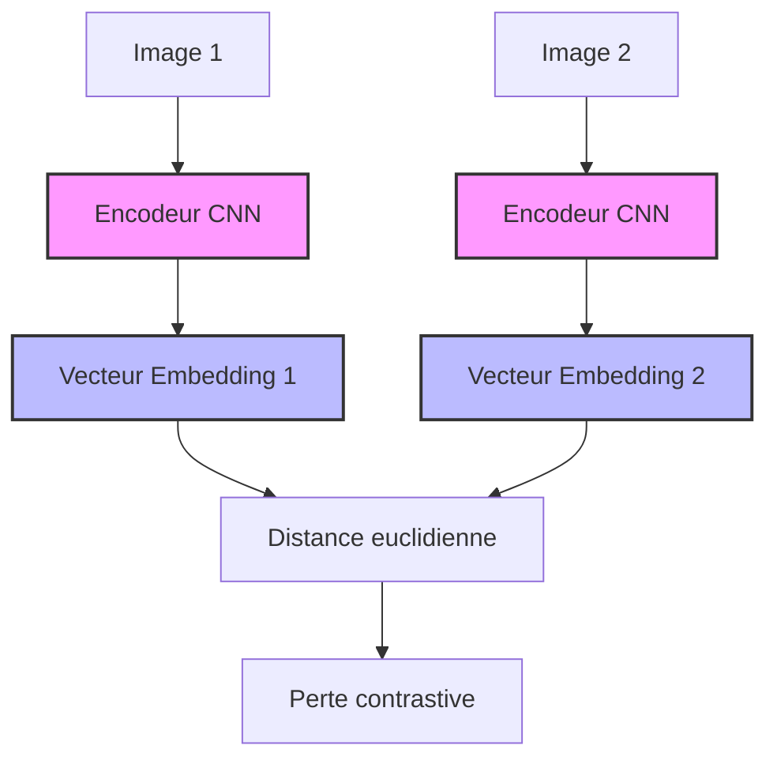
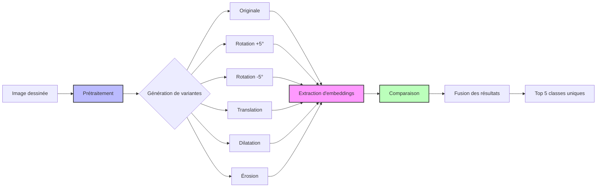

# E3 - Reconnaissance de Gravures Optiques

Ce module implémente un système de reconnaissance de gravures optiques pour verres de lunettes utilisant un réseau de neurones siamois pour comparer les croquis dessinés à la main avec une base de gravures connues.

## Caractéristiques

- API REST sécurisée par OAuth2/JWT
- Interface utilisateur Gradio pour dessiner et reconnaître les gravures
- Application Streamlit dédiée pour une utilisation sur smartphone
- Réseau siamois pour la génération d'embeddings
- Algorithme de recherche par similarité amélioré
- Pipeline de prétraitement d'image avec OpenCV
- Génération de variantes d'images pour une meilleure reconnaissance
- Conteneurisation Docker pour un déploiement facile

## Architecture du système



## Structure du projet

```
E3_MettreDispositionIA/
├── app/                      # Code source de l'application
│   ├── __init__.py           # Initialisation de l'application
│   ├── data_augmentation.py  # Augmentation de données
│   ├── embeddings_manager.py # Gestion des embeddings
│   ├── generate_embeddings.py # Script pour générer les embeddings
│   ├── main.py               # Point d'entrée FastAPI
│   ├── model.py              # Modèle siamois
│   ├── prepare_data.py       # Prétraitement des images
│   ├── train.py              # Script d'entraînement du modèle
│   └── ui.py                 # Interface Gradio
├── data/                     # Données
│   ├── raw_gravures/         # Images brutes par catégorie
│   ├── processed/            # Images traitées
│   └── augmented_gravures/   # Images augmentées
├── embeddings/               # Embeddings précalculés
├── model/                    # Modèles entraînés
│   ├── best_siamese_model.pt # Modèle avec les meilleures performances
│   └── siamese_model.pt      # Modèle standard
├── tests/                    # Tests unitaires
├── poc_smartphone/           # Application Streamlit pour smartphone
├── Dockerfile                # Configuration Docker
├── setup.bat                 # Script d'installation pour Windows
├── setup.sh                  # Script d'installation pour Linux/Mac
├── README.md                 # Documentation
└── requirements.txt          # Dépendances Python
```

## Pipeline de traitement



## Installation

### Prérequis

- Python 3.9+
- pip

### Installation automatisée

#### Windows
```bash
setup.bat
```

#### Linux/Mac
```bash
./setup.sh
```

### Installation manuelle des dépendances

```bash
pip install -r requirements.txt
```

## Utilisation

### Préparation des données

1. Placez vos images de gravures dans des sous-dossiers par catégorie dans `data/raw_gravures/`
2. Prétraitez les images:
```bash
python -m app.prepare_data --data_dir data/raw_gravures --output_dir data/processed
```
3. Augmentez les données (optionnel):
```bash
python -m app.data_augmentation --data_dir data/processed --output_dir data/augmented_gravures
```

### Entraîner le modèle

```bash
python -m app.train --data_dir data/processed --augmented_dir data/augmented_gravures --output_dir model/ --num_epochs 20
```

### Générer les embeddings

```bash
python -m app.generate_embeddings --images_dir data/processed --output_path embeddings/gravures_embeddings.pkl --model_path model/best_siamese_model.pt
```

## Architecture du réseau siamois



### Démarrer l'application FastAPI

```bash
uvicorn app.main:app --host 0.0.0.0 --port 8000 --reload
```

Ensuite, accédez à:
- Interface Gradio: http://localhost:8000/gradio
- Documentation API: http://localhost:8000/docs

### Démarrer l'application Streamlit pour smartphone

#### Windows
```bash
cd poc_smartphone
start_streamlit_app.bat
```

#### Linux/Mac
```bash
cd poc_smartphone
./start_streamlit_app.sh
```

## Traitement des images dessinées



## API REST

### Authentification

```
POST /token
```
Corps de la requête (form-data):
- username: utilisateur
- password: password123

### Reconnaissance de gravure

```
POST /recognize
```
Headers:
- Authorization: Bearer {token}

Corps de la requête (form-data):
- file: image de la gravure

### Liste des gravures

```
GET /gravures
```
Headers:
- Authorization: Bearer {token}

## Améliorations récentes

### Interface Streamlit pour smartphone
- Interface adaptée aux écrans tactiles
- Reconnaissance de 5 classes différentes
- Affichage de la similarité pour chaque classe

### Performances de reconnaissance
- Prétraitement amélioré avec OpenCV (égalisation d'histogramme, réduction du bruit)
- Génération de variantes d'images (rotations, translations, dilatations)
- Algorithme de vote par classe pour une meilleure précision
- Amplification non-linéaire des scores de similarité

## Déploiement avec Docker

### Construire l'image

```bash
docker build -t gravure-recognition:latest .
```

### Exécuter le conteneur

```bash
docker run -p 8000:8000 gravure-recognition:latest
```

## Crédits

Application développée dans le cadre du projet de certification Simplon. 