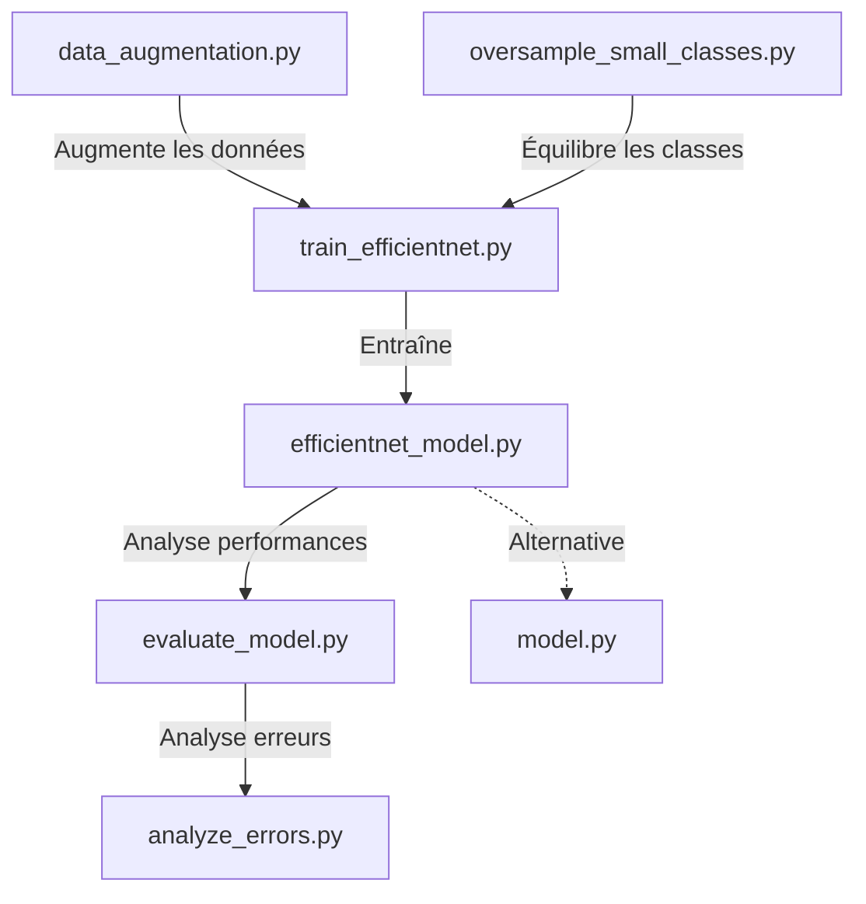

# Scripts Python du projet

Ce dossier contient les scripts Python essentiels pour la reconnaissance de gravures basée sur l'apprentissage profond.

## Vue d'ensemble



## Scripts principaux (pipeline d'entraînement)

- `efficientnet_model.py` - Définition du modèle EfficientNet pour la reconnaissance de gravures:
  - Implémente une architecture basée sur EfficientNet-B0 préentraîné
  - Ajoute une couche d'embedding pour la métrique learning
  - Définit TripletLoss et HardTripletLoss pour l'apprentissage par triplets
  - Fournit des fonctions pour manipuler les embeddings et comparer des images

- `data_augmentation.py` - Augmentation des données pour les gravures:
  - Définit un pipeline d'augmentation avec albumentations
  - Transforme les images en appliquant rotations, flips, déformations géométriques
  - Améliore la robustesse du modèle avec des variations réalistes

- `train_efficientnet.py` - Entraînement du modèle EfficientNet avec triplet loss:
  - Implémente l'entraînement complet avec triplet loss
  - Gère le progressive unfreezing (dégel progressif des couches)
  - Utilise OneCycleLR pour optimiser l'apprentissage
  - Équilibre automatiquement les classes sous-représentées
  - Sauvegarde les meilleurs modèles et visualisations

## Scripts d'évaluation et d'analyse

- `evaluate_model.py` - Évaluation des performances du modèle:
  - Évalue la qualité des embeddings avec k-NN
  - Génère des matrices de confusion normalisées
  - Produit des rapports de classification détaillés
  - Sauvegarde les résultats sous format visuel et textuel

- `analyze_errors.py` - Analyse détaillée des erreurs de classification:
  - Analyse les images mal classées et identifie les tendances
  - Construit des matrices de confusion avancées
  - Génère des visualisations des erreurs les plus fréquentes
  - Crée des rapports HTML interactifs pour explorer les erreurs

- `oversample_small_classes.py` - Équilibrage des classes sous-représentées:
  - Identifie les classes ayant trop peu d'exemples
  - Génère des augmentations spécifiques pour ces classes
  - Equilibre le dataset pour améliorer les performances sur les classes rares

## Scripts pour l'application Streamlit

- `model.py` - Modèle Siamese utilisé comme alternative au modèle principal:
  - Implémente une architecture de réseau siamois
  - Fournit des fonctions de comparaison d'images
  - Utilisé comme solution de repli dans l'application Streamlit

## Diagramme de flux de données

```
           ┌───────────────────┐
           │  Images brutes    │
           └─────────┬─────────┘
                     │
                     ▼
      ┌─────────────────────────────┐
      │     data_augmentation.py    │
      │  oversample_small_classes.py│
      └─────────────┬───────────────┘
                    │
                    ▼
        ┌─────────────────────┐
        │  Images augmentées  │
        └──────────┬──────────┘
                   │
                   ▼
      ┌───────────────────────────┐
      │    train_efficientnet.py  │
      └─────────────┬─────────────┘
                    │
                    ▼
        ┌───────────────────────┐
        │  Modèle entraîné      │
        └────┬──────────────┬───┘
             │              │
             ▼              ▼
 ┌───────────────────┐    ┌────────────────┐
 │ evaluate_model.py │    │ Application    │
 │ analyze_errors.py │    │ Streamlit      │
 └───────────────────┘    └────────────────┘
```

## Structure des données

Le pipeline attend une structure de données spécifique:

```
data/
├── raw_gravures/        # Images brutes non traitées
│   ├── classe_1/        # Une classe par dossier
│   ├── classe_2/
│   └── ...
├── augmented_gravures/  # Images après augmentation
│   ├── classe_1/
│   ├── classe_2/
│   └── ...
```

## Utilisation typique

1. **Augmentation des données**:
   ```bash
   python app/data_augmentation.py --raw_dir data/raw_gravures --output_dir data/augmented_gravures
   ```

2. **Équilibrage des classes**:
   ```bash
   python app/oversample_small_classes.py --raw_dir data/raw_gravures --augmented_dir data/augmented_gravures --min_threshold 10
   ```

3. **Entraînement du modèle**:
   ```bash
   python app/train_efficientnet.py --data_dir data/augmented_gravures --epochs 50 --batch_size 16 --progressive_unfreeze --onecycle
   ```

4. **Évaluation du modèle**:
   ```bash
   python app/evaluate_model.py --model_path model/best_efficientnet_triplet.pt --data_dir data/augmented_gravures
   ```

5. **Analyse des erreurs**:
   ```bash
   python app/analyze_errors.py --incorrect_dir model/incorrect_predictions --output_dir model/error_analysis
   ```
