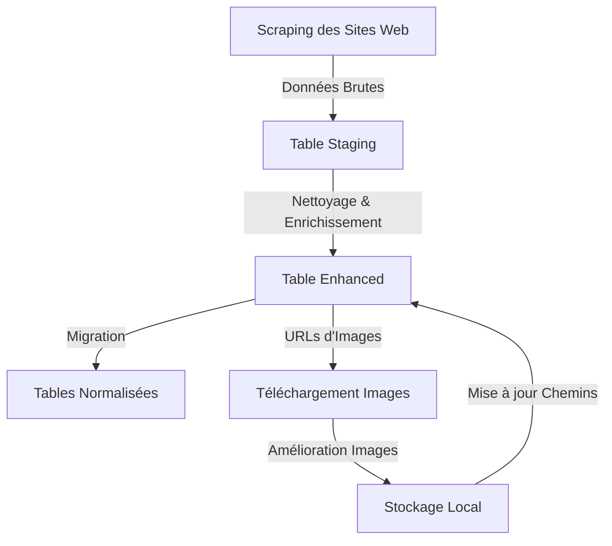
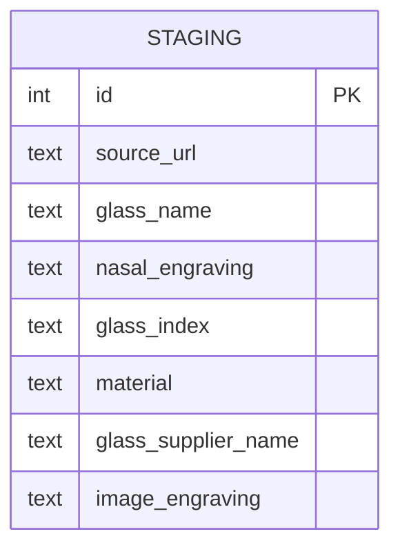
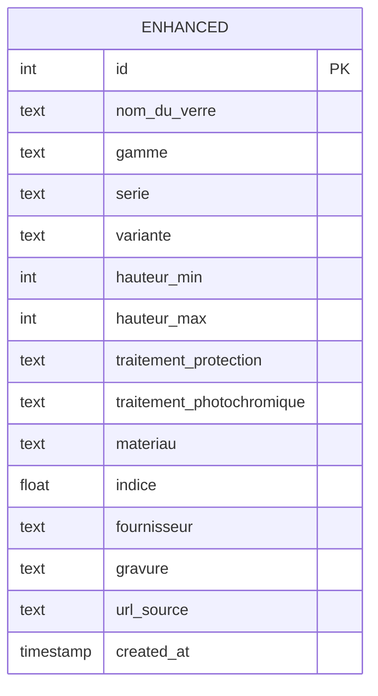
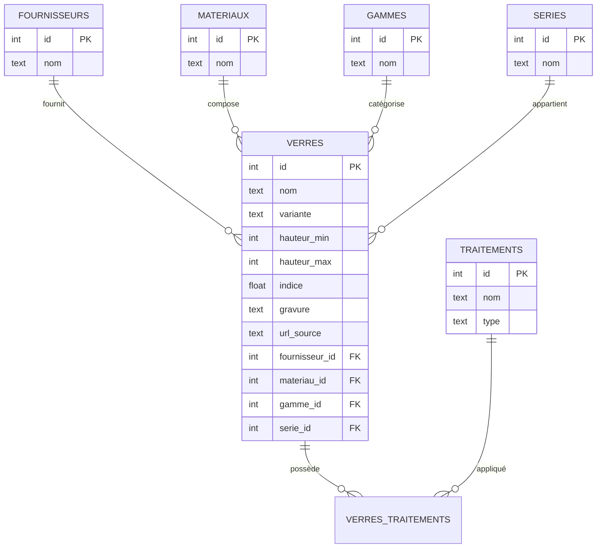

# Système de Gestion des Gravures de Verres Optiques

## 📋 Description du Projet
Ce projet a été développé dans le cadre d'une certification de Développeur en Intelligence Artificielle. Il répond à un besoin concret d'un opticien qui souhaite moderniser son processus de recherche de gravures de verres.

### 🎯 Objectif
Remplacer la méthode manuelle de recherche de gravures de verres par une solution numérique automatisée, permettant ainsi :
- Un gain de temps significatif
- Une réduction des erreurs
- Une meilleure traçabilité
- Un accès rapide aux informations des verres

## 🔄 Flux de Traitement des Données



## 📊 Structure de la Base de Données

### Table Staging (Données Brutes)


### Table Enhanced (Données Nettoyées)


### Tables Normalisées


## 🛠️ Fonctionnalités Principales

1. **Scraping des Données**
   - Collecte automatisée des informations sur les verres
   - Extraction des gravures et images associées

2. **Nettoyage des Données**
   - Standardisation des noms et valeurs
   - Enrichissement des informations
   - Validation des données

3. **Gestion des Images**
   - Téléchargement automatique
   - Amélioration de la qualité
   - Organisation structurée du stockage

4. **Base de Données Optimisée**
   - Structure normalisée
   - Indexation performante
   - Traçabilité des modifications

## 📦 Structure du Projet
```
E1_GestionDonnees/
├── Base_de_donnees/
│   ├── data_cleaning.py    # Nettoyage et enrichissement
│   ├── download_images.py  # Gestion des images
│   ├── migrate_db.sh      # Migration vers structure finale
│   └── images/            # Stockage des images
├── france_optique/
│   └── run_spiders.py     # Scripts de scraping
├── logs/                  # Journaux d'exécution
└── backups/              # Sauvegardes
```

## 🚀 Installation et Utilisation

1. Cloner le repository
```bash
git clone [url_du_repo]
```

2. Installer les dépendances
```bash
pip install -r requirements.txt
```

3. Exécuter le script principal
```bash
./run_project.sh
```

## 📝 Notes
- Les images et données sensibles sont exclues du versionnement
- Les logs sont générés pour chaque exécution
- Des sauvegardes sont créées automatiquement 