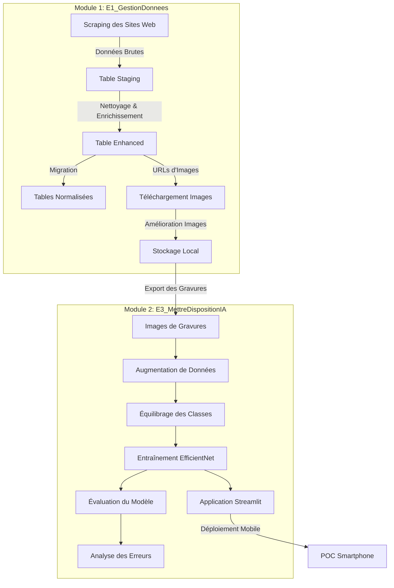
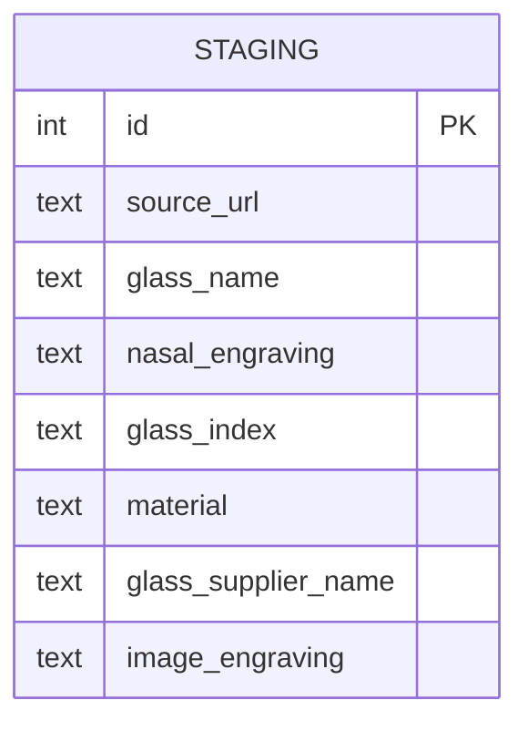
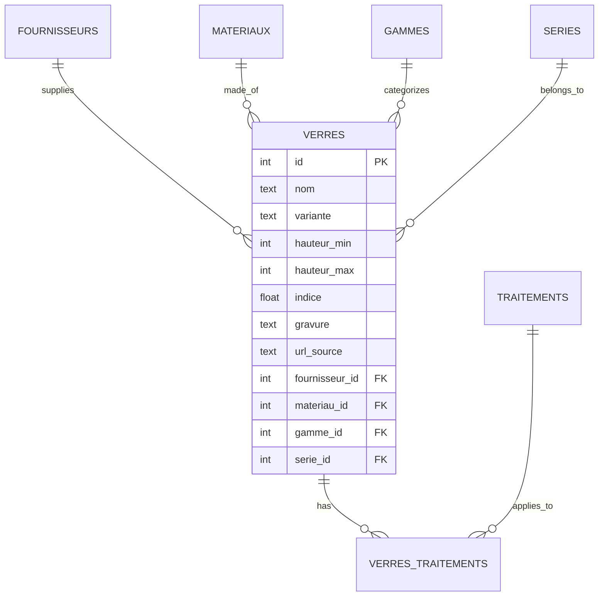

# Système Intégré de Gestion et Reconnaissance de Gravures Optiques

## 📋 Vue d'ensemble du Projet
Ce projet complet a été développé dans le cadre d'une certification de Développeur en Intelligence Artificielle. Il répond à un besoin concret d'un opticien qui souhaite moderniser son processus de gestion et d'identification des gravures de verres optiques.

Le projet se compose de deux modules principaux qui travaillent ensemble :
1. **E1_GestionDonnees** : Système de collecte, nettoyage et stockage des données de gravures
2. **E3_MettreDispositionIA** : Système de reconnaissance des gravures par deep learning

### 🎯 Objectifs
- Remplacer la méthode manuelle de recherche de gravures
- Permettre l'identification rapide des gravures via smartphone
- Automatiser la gestion de la base de données des verres
- Fournir un système robuste fonctionnant avec peu d'exemples par gravure

## 🔄 Architecture Globale



## 📦 Structure Globale du Projet

```
Project/
├── E1_GestionDonnees/                # Module de gestion des données
│   ├── Base_de_donnees/              # Scripts et structure BDD
│   ├── france_optique/               # Scripts de scraping
│   ├── logs/                         # Journaux d'exécution
│   └── backups/                      # Sauvegardes
│
├── E3_MettreDispositionIA/           # Module de reconnaissance IA
│   ├── app/                          # Scripts Python du modèle
│   ├── data/                         # Données d'entrainement
│   │   ├── raw_gravures/             # Images brutes par classe
│   │   └── augmented_gravures/       # Images après augmentation
│   ├── model/                        # Modèles entraînés
│   ├── streamlit_app.py              # Application principale
│   └── run_gravure_pipeline.py       # Pipeline d'entraînement
│
└── poc_smartphone/                   # POC pour l'utilisation mobile
    ├── streamlit_draw_app.py         # Application de dessin
    ├── start_streamlit_app.sh/bat    # Scripts de lancement
    └── drawings/                     # Dessins capturés
```

## 📊 Module 1: Gestion des Données (E1_GestionDonnees)

### Structure de la Base de Données

#### Table Staging (Données Brutes)


#### Tables Normalisées


### Fonctionnalités
- Scraping des sites web de fournisseurs optiques
- Nettoyage et normalisation des données
- Téléchargement et amélioration des images de gravures
- Migration vers une structure optimisée

## 🤖 Module 2: Reconnaissance IA (E3_MettreDispositionIA)

### Architecture du Modèle
- Modèle EfficientNet-B0 préentraîné sur ImageNet
- Apprentissage par Triplet Loss avec mining intelligent
- Embeddings de haute qualité (dimension 256)
- Progressive unfreezing pour optimiser l'apprentissage

### Pipeline Complet
Le script `run_gravure_pipeline.py` automatise l'ensemble du processus:

1. **Augmentation des données** - Génère des variations des images d'origine
2. **Équilibrage des classes** - Équilibre les classes sous-représentées
3. **Entraînement du modèle** - Avec triplet loss et mining semi-hard
4. **Évaluation des performances** - Génère rapports et matrices de confusion
5. **Analyse des erreurs** - Identifie les confusions entre classes
6. **Lancement de l'application** - Interface utilisateur Streamlit

### Utilisation du Pipeline
```bash
# Exécution complète
python E3_MettreDispositionIA/run_gravure_pipeline.py --launch_streamlit

# Options personnalisées
python E3_MettreDispositionIA/run_gravure_pipeline.py --epochs 50 --batch_size 16 --mining_type semi-hard
```

### Performance
- **Précision**: ~97.5% sur le jeu de test
- **Qualité d'embeddings**: Excellente séparation des classes
- **Robustesse**: Bonne résistance aux variations de style et d'orientation

## 📱 POC Smartphone (poc_smartphone)

### Fonctionnalités
- Interface de dessin tactile compatible smartphone et tablette
- Reconnaissance en temps réel des gravures dessinées
- Comparaison avec la base de données d'images de référence
- Sauvegarde des dessins pour enrichir le jeu de données

### Utilisation
```bash
# Lancement sur Linux/Mac
bash poc_smartphone/start_streamlit_app.sh

# Lancement sur Windows
poc_smartphone/start_streamlit_app.bat
```

Accès depuis un smartphone via l'adresse http://[IP_DE_VOTRE_PC]:8501

## 🛠️ Installation et Configuration

### Prérequis
- Python 3.8 ou supérieur
- PyTorch 1.9 ou supérieur
- CUDA (optionnel mais recommandé)
- Streamlit 1.12 ou supérieur

### Installation Globale
```bash
# Cloner le repository
git clone <URL_DU_REPO>

# Installer les dépendances principales
pip install -r requirements.txt

# Installer les dépendances Streamlit (pour le POC smartphone)
pip install -r poc_smartphone/requirements_streamlit.txt
```

### Configuration du Module IA
```bash
# Vérifier la structure des dossiers
mkdir -p E3_MettreDispositionIA/data/raw_gravures
mkdir -p E3_MettreDispositionIA/model

# Lancer le pipeline complet
python E3_MettreDispositionIA/run_gravure_pipeline.py
```

## 📊 Résultats et Impact

Le système permet:
- Une identification immédiate des gravures (< 1 seconde)
- Une réduction significative du temps de recherche (de plusieurs minutes à quelques secondes)
- L'ajout facile de nouvelles gravures au système
- Une meilleure organisation des données optiques
- Une utilisation intuitive sur smartphone

## 🔍 Développements Futurs

- Développement d'une application mobile native
- Intégration d'un système d'apprentissage continu
- Connexion directe avec les APIs des fournisseurs
- Ajout de fonctionnalités de traçabilité avancées
- Extension du modèle à d'autres types de marquages optiques 