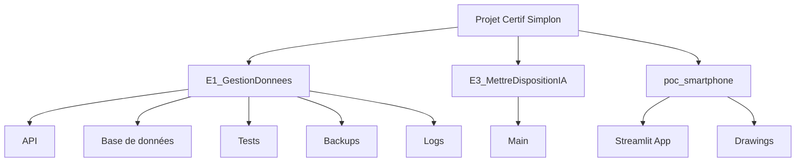
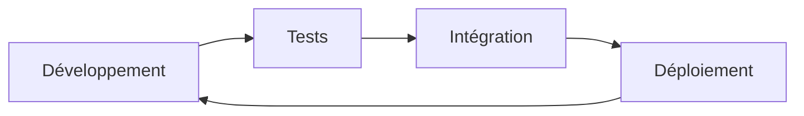
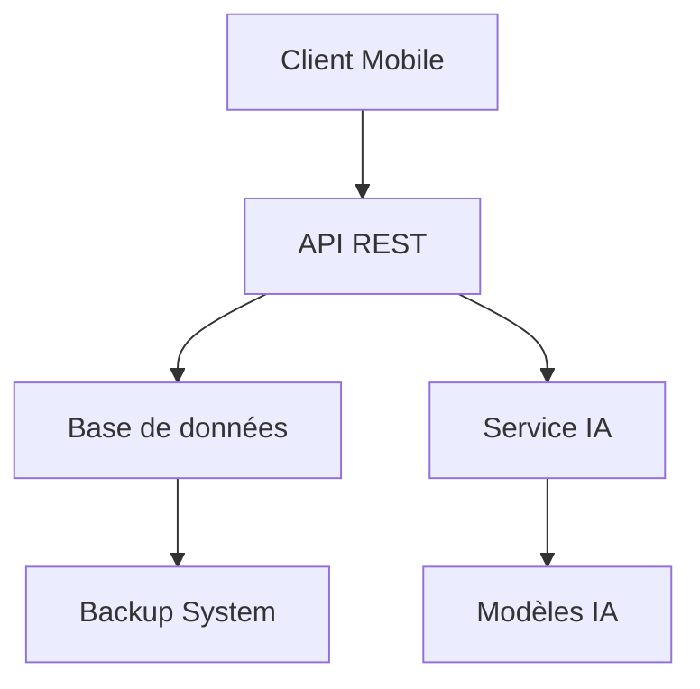

# Projet Certif Simplon

Ce projet est composé de trois parties principales qui forment un système complet de gestion et d'analyse de données pour une application de lunetterie.

## 📁 Structure du Projet



## 🚀 Partie 1: E1_GestionDonnees

Cette partie gère la gestion des données et l'API de l'application.

### Structure
- `api/` : Contient l'API REST
- `Base_de_donnees/` : Gestion de la base de données
- `tests/` : Tests unitaires et d'intégration
- `backups/` : Sauvegardes de la base de données
- `logs/` : Fichiers de logs

### Technologies utilisées
- Python
- SQLite
- Docker
- FastAPI
- Pytest

## 🤖 Partie 2: E3_MettreDispositionIA

Cette partie implémente les fonctionnalités d'intelligence artificielle.

### Structure
- `main/` : Code principal de l'IA
- `requirements.txt` : Dépendances Python

### Technologies utilisées
- Python
- Bibliothèques d'IA
- API REST

## 📱 Partie 3: poc_smartphone

Cette partie est une preuve de concept pour l'application mobile.

### Structure
- `streamlit_draw_app.py` : Application Streamlit
- `drawings/` : Stockage des dessins
- Scripts de démarrage pour Windows et Linux

### Technologies utilisées
- Streamlit
- Python
- Interface de dessin

## 🛠️ Installation et Configuration

### Prérequis
- Python 3.8+
- Docker (optionnel)
- Git

### Installation

1. Cloner le repository
```bash
git clone [URL_DU_REPO]
```

2. Installer les dépendances pour chaque partie
```bash
# E1_GestionDonnees
cd E1_GestionDonnees
pip install -r requirements.txt

# E3_MettreDispositionIA
cd ../E3_MettreDispositionIA
pip install -r requirements.txt

# poc_smartphone
cd ../poc_smartphone
pip install -r requirements_streamlit.txt
```

## 🚀 Démarrage

### E1_GestionDonnees
```bash
cd E1_GestionDonnees
./run_project.sh
```

### E3_MettreDispositionIA
```bash
cd E3_MettreDispositionIA
python main/app.py
```

### poc_smartphone
```bash
cd poc_smartphone
# Windows
start_streamlit_app.bat
# Linux/Mac
./start_streamlit_app.sh
```

## 📊 Tests

Les tests sont disponibles dans chaque module :
```bash
# E1_GestionDonnees
cd E1_GestionDonnees
pytest

# E3_MettreDispositionIA
cd ../E3_MettreDispositionIA
python -m pytest
```

## 📝 Documentation

Chaque partie du projet contient son propre README.md avec des instructions détaillées :
- [E1_GestionDonnees/README.md](E1_GestionDonnees/README.md)
- [E3_MettreDispositionIA/README.md](E3_MettreDispositionIA/README.md)
- [poc_smartphone/README.md](poc_smartphone/README.md)

## 🔄 Workflow de développement



## 📈 Architecture du système



## 🔒 Sécurité

- Les données sensibles sont stockées de manière sécurisée
- Les API sont protégées par authentification
- Les backups sont chiffrés
- Les logs sont régulièrement nettoyés

## 📞 Support

Pour toute question ou problème, veuillez :
1. Consulter la documentation dans chaque module
2. Vérifier les logs dans le dossier `logs/`
3. Contacter l'équipe de support

## 📄 Licence

Ce projet est sous licence [Insérer la licence] 